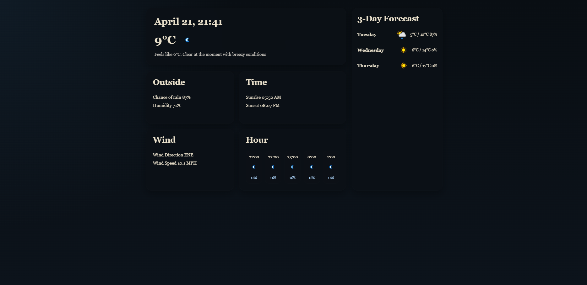

# Weather Dashboard (Flask)

A responsive weather dashboard built using Flask and the WeatherAPI.  
Displays real-time weather data, hourly forecasts, and a dynamic smart summary generated from live conditions.

---

## Features

- Real-time weather data from WeatherAPI
- 3-day forecast with temperatures and rain probability
- Hourly weather breakdown
- Smart summary generation (e.g. *"Clear at the moment with light winds"*)
- Clean, responsive UI using HTML and CSS

---

## Tech Stack

- Python (Flask)
- HTML / CSS
- Jinja2 templating
- WeatherAPI

---


## Screenshot




## How It Works

The application fetches weather data from the WeatherAPI and processes it into structured sections:

- Current conditions (temperature, feels like, summary)
- Daily forecast data
- Hourly forecast data
- Custom logic to generate a human-readable weather summary

---

## Getting Started

### 1. Clone the repository
```bash
git clone https://github.com/CamCawood/weather-dashboard-flask.git
cd weather-dashboard-flask
pip install flask requests
```

### 2. Add your API key
Replace the API key in app.py with your own from:
https://www.weatherapi.com/

### 3. Run the app
python app.py
